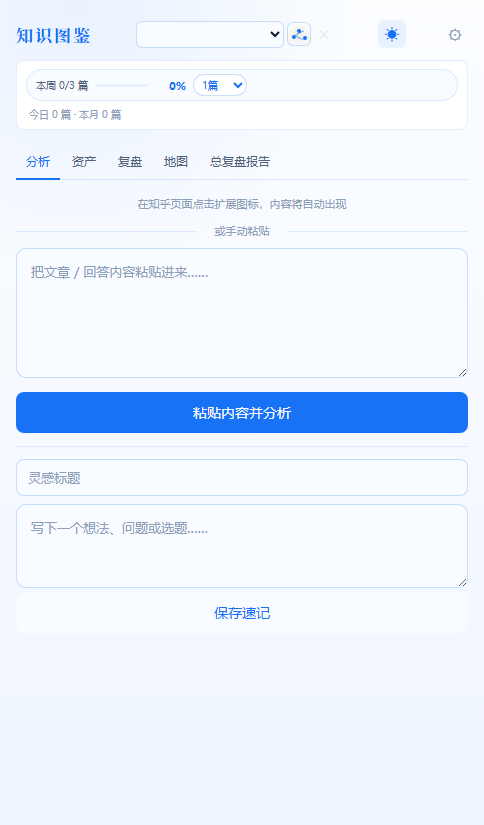
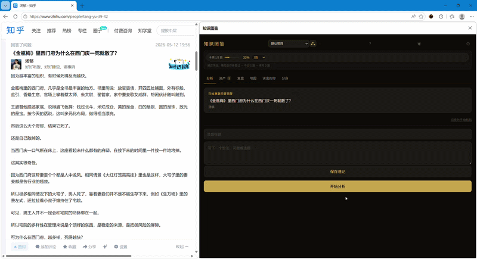
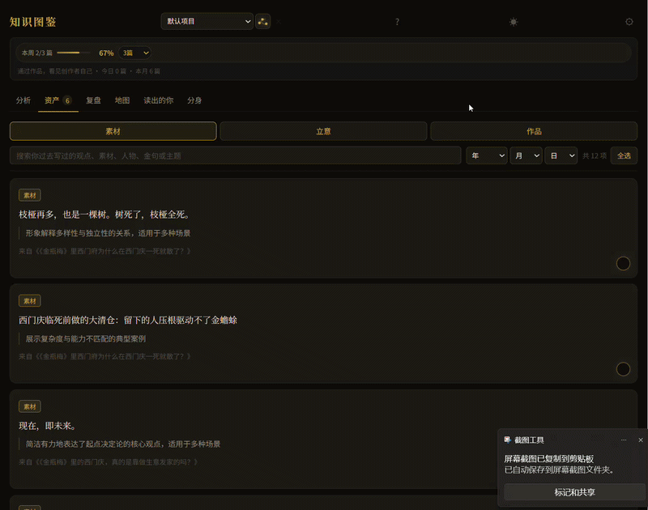
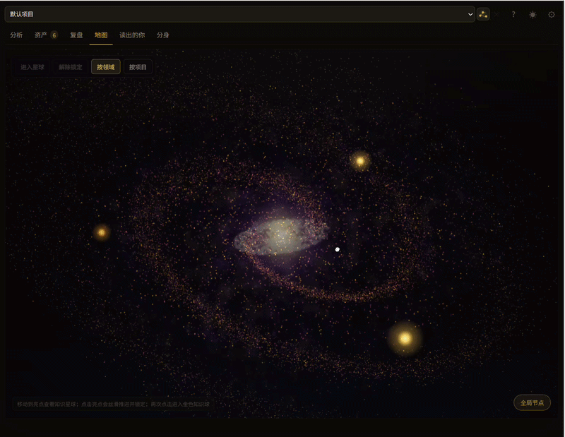

# 知识图鉴

知识图鉴是一个面向持续创作者的 Chrome 扩展，用来把知乎创作内容整理成可搜索、可复盘、可继续创作的个人知识资产。

这个版本包含知乎回答、文章、想法批量导出和批量分析能力，并支持按创建日期筛选导出范围。

## 产品预览

| 侧边栏首页 | 在知乎页面里使用 |
| --- | --- |
|  |  |

| 资产库 | 知识地图 |
| --- | --- |
|  |  |

## 功能

- 抓取知乎文章或手动粘贴内容。
- 用 AI 分析文章定位、写作技法、可复用素材、立意精华和知识节点。
- 管理素材、立意和作品资产。
- 用时间轴查看作品演化。
- 在侧边栏批量导出自己的知乎回答、文章和想法。
- 导出内容时可选择起始日期和结束日期。
- 导入导出的 JSON，批量分析历史内容并沉淀到资产库。

## 安装

1. 在 GitHub 页面点击 `Code`。
2. 点击 `Download ZIP` 下载代码。
3. 解压 ZIP，并把内容放到固定安装目录，例如 `C:\参赛文档\知识图鉴_当前安装版`。
4. 打开 Chrome / Edge 的扩展程序页面。
5. 开启「开发者模式」。
6. 点击「加载已解压的扩展程序」。
7. 选择这个固定安装目录。

## 升级

升级时不要在浏览器里删除旧插件。

1. 关闭插件侧边栏。
2. 用新版本文件覆盖固定安装目录。
3. 回到 Chrome / Edge 扩展程序页面。
4. 点击知识图鉴卡片上的「重新加载」。

这样插件 ID 不变，原来的本地数据会继续保留。

## 导出知乎内容

1. 在同一个浏览器中登录 `https://www.zhihu.com/`。
2. 打开插件侧边栏。
3. 进入「导出内容」。
4. 选择起始日期和结束日期。
5. 按需要点击「导出回答」「导出文章」或「导出想法」。

结束日期留空表示导出到当前时间。起始日期和结束日期都留空时，会导出对应类型的全部内容。

导出的 JSON 文件保存位置由浏览器下载设置决定，通常是系统「下载」文件夹。

## 批量分析历史内容

1. 先在「导出内容」里导出回答、文章或想法 JSON。
2. 回到「分析」页。
3. 在「批量分析历史内容」里点击「选择 JSON」。
4. 可以一次选择一个或多个导出的 JSON 文件。
5. 点击「开始批量分析」。

批量分析会逐条调用当前设置的 AI 模型，并把分析结果保存到资产库。同一个项目里已经分析过的同 URL 内容会自动跳过。

## 导出文件名

不筛选日期时：

```text
zhihu_answers.json
zhihu_articles.json
zhihu_pins.json
```

按日期筛选时：

```text
zhihu_answers_2026-05-17_to_2026-06-04.json
zhihu_articles_2026-05-17_to_2026-06-04.json
zhihu_pins_2026-05-17_to_2026-06-04.json
```

## 二次开发

主要入口文件：

- `manifest.json`
- `panel.html`
- `panel.js`
- `export_zhihu_answers.js`
- `background.js`
- `content.js`
- `options.html`
- `options.js`
